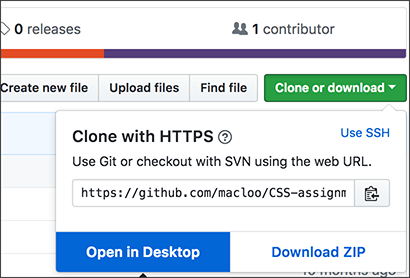

# CSS Assignment 3 (Assignment 5)

This repo contains your assignment starter files, including all images.

1. **Fork** this repo (make sure you are logged into GitHub). How to: [Forking and Cloning with GitHub](https://github.com/macloo/github-howto-and-github-desktop/tree/master/forking_and_cloning)

2. **Clone** your new repo so you have it on your hard drive (see previous link). Remember to save it into the folder where you are keeping all your projects for this course. Make sure you clone the repo from the GitHub page with YOUR NAME (not the name **macloo**) *in the URL.* Check the browser address bar and make sure you see **YOUR NAME** in the URL.

    

3. WATCH where you are putting the cloned repo as you save from GitHub!

4. Use your GitHub app to create a **local branch** named *gh-pages*. Switch to that branch and do all your work in that branch. Note that the hyphen and all lowercase letters are **essential** in the branch name *gh-pages*. Stay in that branch, and do all your work in that branch. How to: [Git Branches](https://github.com/macloo/github-howto-and-github-desktop/tree/master/git_branches)

## Goals of this assignment (overview)

**Font families:** Build two very good, very correct font stacks, one for everything and the other only for headings. One stack will be serif, and the other will be sans-serif. You can choose whether headings are serif and everything else is sans-serif, or the opposite. **You must include one Google font in EACH stack.** The total number of different Google font families used will be two (one Google font will be serif; the other Google font will be sans-serif).

[This video](https://www.youtube.com/watch?v=YaGPuatU1-o) shows how to build **font stacks** correctly.

[Choosing Google fonts](https://www.youtube.com/watch?v=1S3ga5Or5ec): A different video how-to.

**Grid layout using grid areas:** Use CSS grid properties to layout the wide version of *index.html* to match [this first example](screen_captures/full-size-styled-sm.png). There are instructions about this below.

**Responsive web design:** After you have solved the wide layout, write one media query in the same CSS file to style the small-screen version to match [this second example](screen_captures/phone-size-styled-sm.png). There are instructions about this below.

## Files

You will change only two files for this assignment.

### index.html

You will need to **add** exactly one element inside the `<head>`. This element is required for using Google fonts. See the [Choosing Google fonts](https://www.youtube.com/watch?v=1S3ga5Or5ec) video for guidance. The exact location of the added element is *important* &mdash; where is it in relation to the LINK element for your own stylesheet?

Other than adding that one element to the `<head>`, DO NOT CHANGE ANYTHING in this file!

### css/main.css

Familiarize yourself with the file. You should understand all the CSS rules here and what they do. If not, ask!

**You will add many things to this CSS file.** Do not change or delete any line that has a `/* keep */` comment at the end.

You will **add** one media query at the *bottom* of the CSS file. That will be necessary to make the page responsive.

## Instructions

Remember to work only inside your *gh-pages* branch. You will edit the existing files *index.html* and *main.css*. Only those. Nothing else.

Please follow the steps IN ORDER, and do one part at a time.

### Part 1: Font families and Google fonts

Before you begin, be sure to read Robbins chapter 12 and watch the video about [choosing Google fonts](https://www.youtube.com/watch?v=1S3ga5Or5ec).

You need to understand all the requirements of a **font stack** to do this assignment correctly. The order of fonts is important.

**VERY IMPORTANT REQUIREMENT:** DO NOT use any Google font that is used in the [Google fonts](https://www.youtube.com/watch?v=1S3ga5Or5ec) video. Four Google fonts are used in the video. There will be a high penalty for using even one of those four fonts.

1. Following the procedures shown in the video, choose two Google font families: one is for all the headings on the page, and the other is for everything else. Make sure they both *look good together* and are *not too similar to each other.* Make sure the one used in paragraphs has good *readability* at a small size.

2. You may choose: (1) either your headings are all serif fonts, and everything else is sans-serif, or (2) *the opposite,* your headings are all sans-serif fonts, and everything else is serif. PAY ATTENTION to serif and sans-serif, and NEVER MIX them together in a single font stack.

3. Add the appropriate element to the HTML `<head>` element for your Google fonts.

4. **Edit the two existing font-family declarations** in the CSS file to include your Google fonts.

5. Add *at least one* other common font family to each of those declarations, and make sure it is a suitable companion to the Google font you have named. Note that **you might need to add two,** because a common font on Windows is not always a common font on Mac, and vice versa. You will have to LOOK UP *common font families* — don't just guess. You will lose points if you make bad choices. This is demonstrated in [the video about font stacks](https://www.youtube.com/watch?v=YaGPuatU1-o).

6. Add the correct *generic* at the END of each declaration. Make sure you are choosing the best one to match the fonts preceding it in the declaration. Generics are covered in your book (chapter 12) and in the font stacks video.

**Test your page** for all the font options by deleting, saving and reloading &mdash; as many times as needed.

**TIP:** When you're selecting a font for the operating system you don't have (Mac or Windows), you can [look it up on Wikipedia](https://en.wikipedia.org/wiki/List_of_typefaces) to see an image of how it looks. Not on Wikipedia? Then is it really a *common* font?

CREATING THESE FONT STACKS CORRECTLY IS IMPORTANT TO YOUR GRADE FOR THIS ASSIGNMENT.

### Part 2: Grid layout using grid areas

In the starter CSS and HTML, grid areas are already set up for you. The initial layout [looks like this](screen_captures/unstyled-original-sm.png) &mdash; it is a 5-column, 2-row grid.

Using grid areas, you will change the CSS so that the layout matches [this first example](screen_captures/full-size-styled-sm.png).

IMPORTANT: **Your fonts** will look different from those in the example.

*Grid areas* are covered in Robbins, pages 458-459 ("Defining grid areas") and 465-466 ("Positioning by area"). Using the area names, you can easily change the position of an item and the number of grid cells that it spans.

**I am requiring you to use grid areas in this assignment.**

**NOTE:** We do NOT use `grid-row-start` or `grid-column-start` when we use grid areas.

1. Follow the screen capture shown in [the example](screen_captures/full-size-styled-sm.png) to arrange all 10 grid items. Your first job is to get everything in the right position to match that image. You will CHANGE the number of rows and the number of columns in the starter CSS:

    ```
    grid-template-columns: repeat(5, 1fr);
    grid-template-rows: repeat(2, auto);
    ```

2. Do NOT use pixels (`px`) in the `grid-template-columns` or `grid-template-rows` values. Try to use only the grid `fr` unit or `auto`; you may use `%` if you find it easier, but I think `fr` will be better.

3. You will CHANGE the lines below `grid-template-areas:` to create your layout. Remember, any grid item may span more than one column and/or more than one row.

    ```
    grid-template-areas:
        "header arial georgia pairing bobwhite-quail"
        "readability line-length helvetica typeface footer";
    ```

4. After you have the positions of all grid items (view in your browser and compare to [the example](screen_captures/full-size-styled-sm.png)), you will need to adjust `padding` and (much more rarely) `margin` on various grid items to make them match the example. Do not let text crowd against the left or right edges of anything adjacent to the text.

5. You will also need to make changes to `font-size` for some grid items. In some cases, you will also need to specify `line-height`. It is understood that **your fonts** will look different from those in the example. Some grid items have larger text than others &mdash; that is what you're looking for and adjusting to match.

6. In the `typeface` grid item, you are expected to use `text-shadow` to make the appearance match the example. It is understood that **your fonts** will look different from those in the example.

Before you begin Part 3, everything in the page should match the example when you view *index.html* in Chrome. It is understood that **your fonts** will look different from those in the example.

### Part 3: Responsive web design

There are two ways to design a page initially. One is to design it for a wide screen, a desktop monitor, and then use media queries to adapt it to small screens. The other way is to design for mobile (small) first, and then use media queries to adapt it to wider screens.

This assignment requires you to take the first approach, even though "mobile first" is the preferred method nowadays. Therefore, your media query in this assignment must adapt the design to look good on small screens. **The reason** is that I think the first part (wide screen design) will be harder for you, so do the hard part first, and the easy part second.

The video [CSS media queries and responsive web design](https://www.youtube.com/watch?v=D2HW4_vl9zM) is strongly recommended. In the second half of the video, a grid example is demonstrated. **NOTE:** The first part of the video helps explain how to write a media query. The later part of the video is exactly about grid.

1. The viewport `meta` element has already been added to the `<head>` in the HTML file.

2. At the bottom of the CSS file, write a media query for `screen` with one *breakpoint* (see Robbins chapter 17 and the video). The breakpoint will indicate the width at which the page changes. Choosing a good number for this breakpoint is part of your assignment. DO NOT choose the width of a specific device. Use the **Chrome Developer Tools** to find a suitable breakpoint measured in pixels (`px`). [This 4-minute video](https://www.youtube.com/watch?v=MLhfzhrzfvo) demonstrates exactly how to do that.

3. In that media query, specify any changes that are needed to make the page look like the [small-screen example](screen_captures/phone-size-styled-sm.png) (your fonts will be different). You will certainly change values for `grid-template-columns`, `grid-template-rows` and `grid-template-areas`. To grade this, we will view your page in Chrome with Device Mode set to iPhone 6/7/8.

4. Changes must also be made in the media query to `padding` for most grid items.

4. The graphic at the top of the page (in the `header`) becomes unreadable at a small size, so it makes sense to *hide it.*  **HINT:** Use the *display* property to hide something. Look it up.

5. There should be no need to change `font-size` or `line-height` for any grid item in the media query.

6. **Do not include any lines in the media query that are not needed.** For example, you are not changing any background color. Therefore, no `background` property should appear anywhere in the media query.

In Chrome, you will test your page for different device sizes using the Developer Tools (View menu > Developer > Developer Tools). **YOU ARE supposed to use CHROME.** At 1:25 in [this 4-minute video](https://www.youtube.com/watch?v=MLhfzhrzfvo), you will see exactly how to test for device sizes.

## Commit and push

When everything is finished, save both files, commit and push (or publish, the first time you publish the branch) to GitHub. Be sure to stay in your *gh-pages* branch for all steps. DO NOT forget to publish/push your repo after you have carefully checked your work! How-to: [Publish or Push: Git Commit and Sync](https://github.com/macloo/github-howto-and-github-desktop/tree/master/git_commit_and_sync)

## Check the rubric and submit in Canvas

Be sure to [check the rubric](rubric.md) and **SUBMIT THE URL of your GitHub repo** in Canvas to complete this assignment.

Note that the rubric covers *each one* of the three sections in these instructions:

* Part 1: Font families and Google fonts
* Part 2: Grid layout using grid areas
* Part 3: Responsive web design
